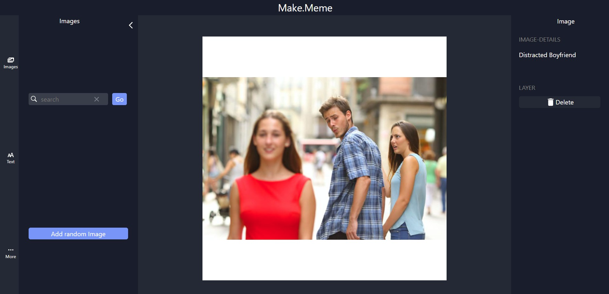
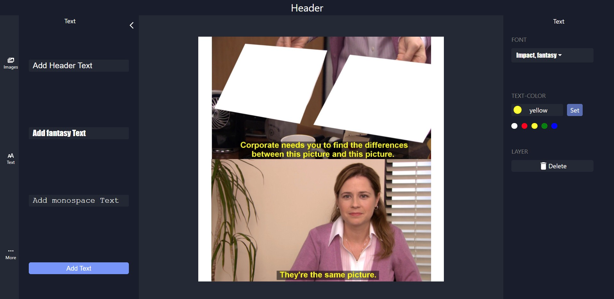

# Make.Meme

## VIDEO PREVIEW!!

https://user-images.githubusercontent.com/70088500/162045014-406af552-bd1a-49ff-8700-7f63a11369b0.mov

## Check out my latest project >> [ Meme Maker WEBAPP](https://Mofe1015.github.io/Make.meme)

This is a fully functional meme making web app made with REACT, JAVASCRIPT, CSS, HTML.
implementing the basic workings of REACT with features like state, effect and api calls.
The meme images are called from an API and text inputs have resize, drag, font-type and font-color changing functionality .

So far, The web app is mobile responsive, certain features don't work on mobile but will be implented soon .

## NOTICE!!

    This is just a Project WebApp, certain  features may not be  functional

## Design ❄👌

- Front End: HTML, CSS, Vanilla JS, REACT
- Back End: JavaScript

## Building 🏢🚀

1. Clone the repo to your local computer.
2. Make sure you have Node, Npm and its necessary packages installed.
3. Open and run the the project with VS Code or Android Studio 3.x(Using: "npm start" in the integrated terminal)

## Contribution 🍕🗺

Feature requests, issues, pull requests and questions are welcome.

## Bugs 😭🐛

If you encounter any bugs or are facing any issues with the code, please don't hesitate to reach out to me.

email : mofeomotosho@gmail.com

### MOFE
